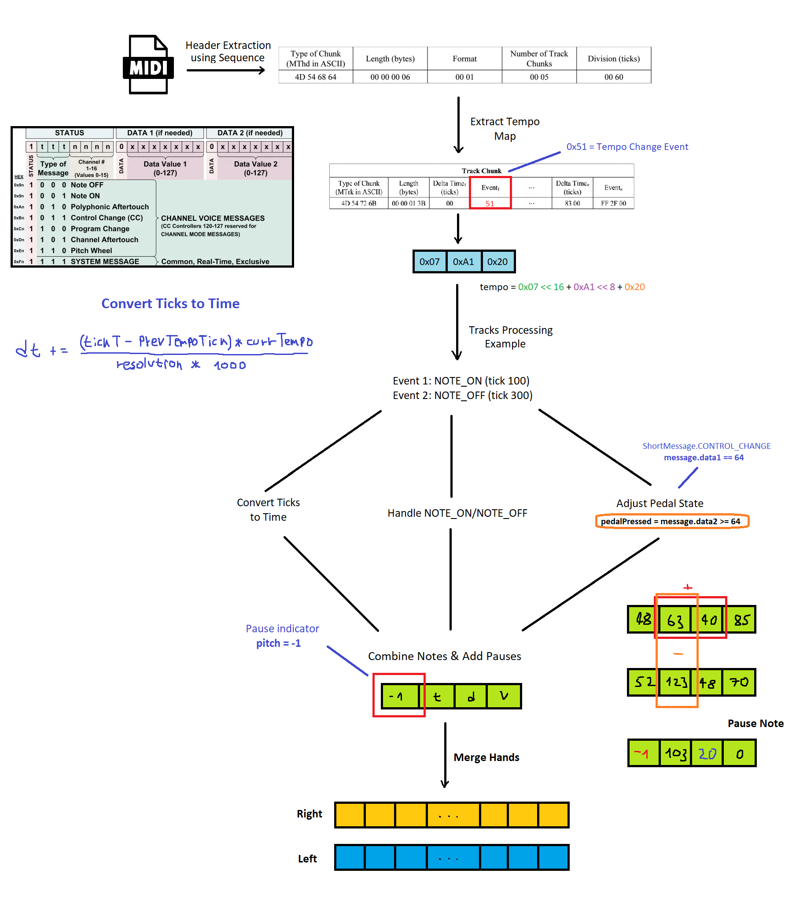

# MIDI2Object API

## Overview
This is an API designed to analyze and extract information from MIDI files, particularly for piano. It allows users to upload a MIDI file and receive structured data that includes information about notes (hand, pedal activity, note duration, pauses, and more). Those information can be used for MIDI data analysis or creating piano-like applications.


## Understanding MIDI Files
MIDI (Musical Instrument Digital Interface) files are a standard format for storing musical data. Unlike audio files, which store actual sound, MIDI files store instructions on how music should be played, including:

- **Note Information**: Which notes are played, their pitch, velocity (how hard the note is played), and duration.
- **Timing**: When notes are played and their exact timing relative to each other.
- **Control Changes**: Information on changes in control parameters like pedal usage, volume, and more.
- **Channels**: MIDI data is organized into channels, where each channel can represent different instruments or different parts of a piece.



## Features
- **Hand Detection**: Automatically distinguishes between notes played by the left and right hands.
- **Pedal Activity**: Detects when the sustain pedal is active or inactive.
- **Note Duration and Pauses**: Extracts information on note durations and pauses between them.

### API Usage
To upload a MIDI file and extract information:
```
Endpoint: /midi/upload
Method: POST
Payload: Multipart form data with a file field named 'file'.
```

Example Response:
```json
{
  "rightHand": [
    {
      "pitch": 60,
      "velocity": 80,
      "duration": 63,
      "startTime": 0,
      "pedal": false
    },
    {
      "pitch": 64,
      "velocity": 75,
      "duration": 62,
      "startTime": 63,
      "pedal": true
    }
  ],
  "leftHand": [
    {
      "pitch": 48,
      "velocity": 85,
      "duration": 63,
      "startTime": 0,
      "pedal": false
    },
    {
      "pitch": 52,
      "velocity": 70,
      "duration": 64,
      "startTime": 63,
      "pedal": true
    }
  ]
}

```
## Contributing
API needs some optimization and contributions are welcome! If you'd like to contribute, please fork the repository and use a feature branch. Pull requests are welcome.

1. Fork the Repository: <br>
```bash git clone https://github.com/VasilijeJukic01/MIDI2Object-api.git```
2. Create a New Branch: <br>
```bash git checkout -b feature/YourFeature```
3. Commit Your Changes: <br>
```bash git commit -m 'Add some feature'```
4. Push to the Branch: <br>
```bash git push origin feature/YourFeature```
5. Open a Pull Request: <br>
Go to the repository on GitHub and open a pull request.

## License
This project is licensed under the MIT License. See the [MIT License](LICENSE) file for details.
